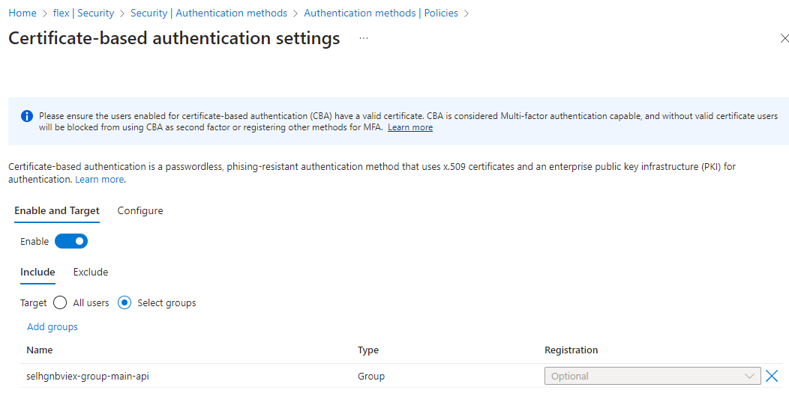
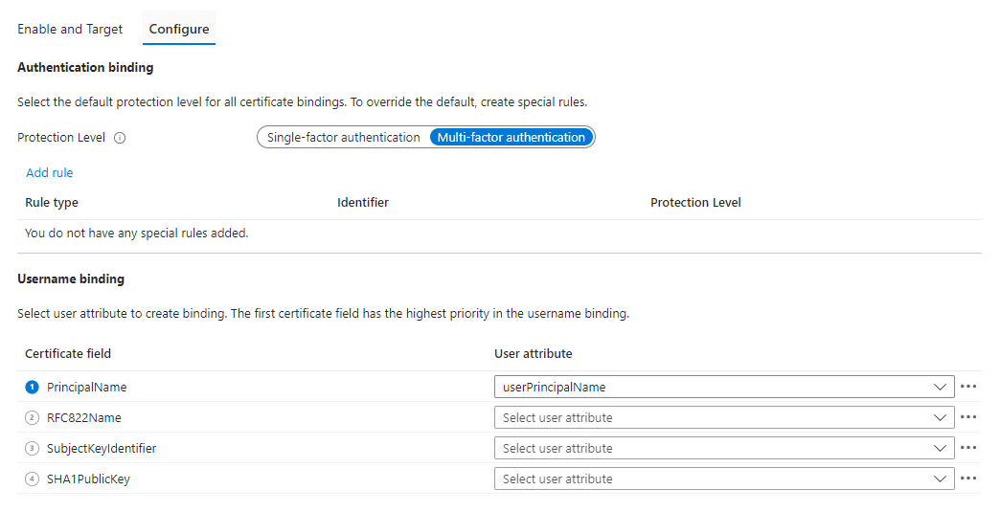

# Quick way to test Azure AD Certificate Based Authentication 

This is a "quick & dirty" way to enable essential testing of Azure AD CBA in test environments. 
Do not use this method in production environments, this is only for security testing of the feature, and relies on self-signed certificates that are not published via CRL.  

[MS docs source](https://learn.microsoft.com/en-us/azure/active-directory/authentication/how-to-certificate-based-authentication#step-4-configure-username-binding-policy) 


## Pre-requisites 

1. The user configuring the service needs to have both Azure AD Roles: GA and Authentication Policy Administrator

2. Create single group which is assigned to authentication methods, ensure the user in the group is referenced in ['openSSL.conf'](#opensslconf) as per under altNames in the example, for the CSR. 

This will create cert that looks like this:


3. Create config file as per ['openSSL.conf'](#opensslconf)
4. Run the scripts below in part [setup.sh](#setupsh)
5. Below is example picture:


## Setup

1. Upload the root certificate ``rootCA.cer`` to Azure AD 
   
- Please note that we select to leave the CRL settings empty, this will result in revokations not being checked as per following documentation 


1. Attach this user to authentication methods via the configured group



3. Configure CBA for single and or multi-factor auth



## Setup in bash or bash cloud shell

Had to consult google and chatGPT to do this quickly enough (without proper PKI setup)

### openSSL.conf

```conf
[ req ]
default_bits = 2048
prompt = no
default_md = sha256
distinguished_name = dn

[ dn ]
CN = shantic@thx.dewi.red

[ usr_cert ]
subjectAltName = @alt_names

[ alt_names ]
otherName.1 = 1.3.6.1.4.1.311.20.2.3;UTF8:shantic@thx.dewi.red
``` 

### setup.sh
```sh
#!/bin/bash

# Configuration file path
CONFIG_FILE="openSSL.conf"

# Step 1: Generate a private key for the root certificate
openssl genpkey -algorithm RSA -out rootCA.key -pkeyopt rsa_keygen_bits:2048

# Step 2: Create the root certificate with Santa Claus's DN info
openssl req -x509 -new -nodes -key rootCA.key -sha256 -days 1024 -out rootCA.pem -subj "/C=FI/ST=Dewi2Lapland/L=Rovaniemi/O=Santa Claus CTO Office/OU=Gift Production/CN=santaclausDewi2"

# Convert the root certificate to DER format
openssl x509 -outform der -in rootCA.pem -out rootCA.cer

# Step 3: Generate a private key for the user
openssl genpkey -algorithm RSA -out userkey.pem -pkeyopt rsa_keygen_bits:2048

# Step 4: Create a certificate signing request (CSR) for the user using the configuration file
openssl req -new -key userkey.pem -out usercsr.pem -config ${CONFIG_FILE}

# Step 5: Sign the CSR with the root certificate, creating the client certificate
openssl x509 -req -in usercsr.pem -CA=rootCA.pem -CAkey=rootCA.key -CAcreateserial -out usercert.pem -days 365 -extfile ${CONFIG_FILE} -extensions usr_cert

# Convert the user certificate to DER format
openssl x509 -outform der -in usercert.pem -out usercert.cer

# Step 6: Export the user certificate and private key to a PKCS#12 (.pfx) file
openssl pkcs12 -export -out usercert.pfx -inkey userkey.pem -in usercert.pem
```

## Confirm the test

- The cert is typically prompted, but I had some scenarios where it was automatically selected, in these scenarios it is worth checking that there are no previously signed-in sessions etc. 


- You can confirm also the sign-in logs to display the X.509 certificate as sign-in method


## Troubleshooting

After enabling the setting, you might have delay of 30-60 mins before the authentication method works. Also bare in mind, that you need ensure you're authentication strenghts align with CBA if you have configured that setting in CA.

Also you might see a situation where CBA is not accepted for MFA, this might be due to some delay or conflict of CA policies. 


- If still having trouble (and you suspect it is not the delay) While not making much sense, you can re-enforce the setting for single and multifactor auth without actually changing the settings. Re-enforcing will still refresh the setting against graph, by selecting any of the settings in gui and choosing 'save'


